# CSCE 435 Group project

## 0. Group number: 13

## 1. Group members:
1. Kyle Diano
2. Connor Bowling
3. Chris Anand
4. Connor McLean

## 2. Project topic: Parallel Sorting Algorithms Comparison

### 2a. Brief project description

We will compare the performance of four parallel sorting algorithms implemented using MPI and CUDA. The algorithms to be compared are:

- Parallel Bitonic Sort
- Parallel Mergesort
- Parallel Odd-Even Transposition Sort
- Parallel Sample Sort

Each of these algorithms will be assessed on multi-core CPU architectures using MPI and on NVIDIA GPUs using CUDA.

### 2b. Pseudocode for each parallel algorithm

- For **Parallel Bitonic Sort**:
  - MPI: We will use `MPI_Send` and `MPI_Recv` for comparison exchanges between processes.
  - CUDA: The compare-exchange operations will be performed in a CUDA kernel, with data transfer to/from the GPU occurring before and after the sort.

```
procedure BITONIC_SORT(label, d)
begin
    for i := 0 to d - 1 do
        for j := i downto 0 do
            if (i + 1)st bit of label = j th bit of label then
                comp exchange max(i);
            else
                comp exchange min(j);
        end for
    end for
end BITONIC_SORT
```

- For **Parallel Mergesort**:
  - MPI: Data partitioning and merging will involve `MPI_Scatter` and `MPI_Gather`.
  - CUDA: Sorting within each partition will be handled by a CUDA kernel.

```
procedure PARALLEL MERGE SORT(id, n, data, newdata)
begin
    data := sequentialmergesort(data)
    for dim := 1 to n do
        begin
            data := parallelmerge(id, dim, data)
        end
    newdata := data
end PARALLEL MERGE SORT
```

- For **Parallel Odd-Even Transposition Sort**:
  - MPI: The compare-exchange operations will involve `MPI_Sendrecv` for pairwise comparison exchanges.
  - CUDA: Sorting steps will be carried out within CUDA kernels, with the necessary data shuttling to/from the GPU.

```
procedure ODD-EVEN PAR(n)
begin
    id := process's label
    for i := 1 to n do
        begin
            if i is odd then
                if id is odd then
                    compare-exchange min(id + 1);
                else
                    compare-exchange max(id - 1);
            if i is even then
                if id is even then
                    compare-exchange min(id + 1);
                else
                    compare-exchange max(id - 1);
            end if
        end for
    end for
end ODD-EVEN PAR
```

- For **Parallel Sample Sort**:
  - MPI: We will use `MPI_Gather` to collect samples, and MPI_Bcast for broadcasting splitters.
  - CUDA: Local sorting and data assignment to buckets will be done with CUDA kernels.

```
procedure PARALLEL_SAMPLE_SORT(id, p, data)
begin
    localData := sort(data)
    samples := select_samples(localData, p-1)
    allSamples := gather_samples(samples)
    
    if id = 0 then
        sortedSamples := sort(allSamples)
        splitters := select_splitters(sortedSamples, p-1)
    end if
    
    splitters := broadcast(splitters)
    bucketedData := assign_to_buckets(localData, splitters)
    
    exchangedData := exchange_data(bucketedData, id, p)
    sortedExchangedData := sort(exchangedData)
    
    return sortedExchangedData
end procedure
```

## Performance Analysis of Parallel Sample Sort

### Strong Scaling Analysis for Sample Sort (main)
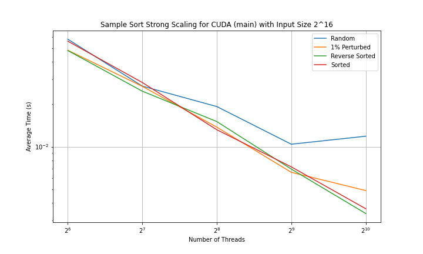
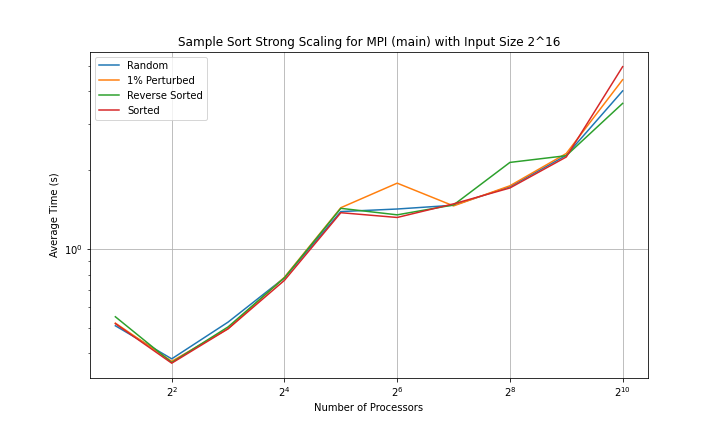
#### Graph Overview
These graphs represent the MPI and CUDA implementation for Sample Sort and the measure the main region's average time taken to sort 2^16 values of various input types (1% Pertubed, Sorted, Reverse Sorted, Random) for an increasing number of threads (CUDA) or processes (MPI).

#### Trends
For the CUDA implementation, all of the input types decrease in execution time as the number of threads is increased.

For the MPI implementation, all of the input types increase in execution time as the number of processes is increased.

#### Interpretation
The practically linear decrease in execution time for CUDA indicates an overall excellent use of the increased parallelism accessible.

The increase in execution time for MPI shows that even as the parallelism is increased, the overall execution time is slower and can't take full advantage of the accessible parallelism.

### Strong Scaling Analysis for Sample Sort (comp_large)
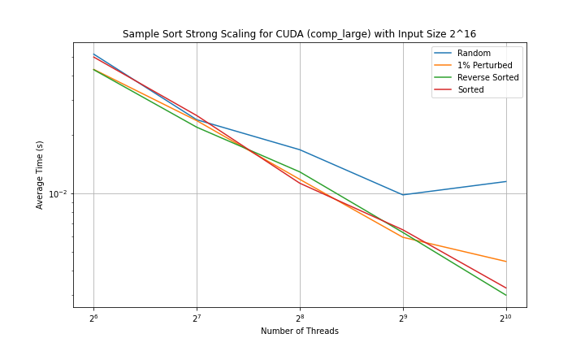
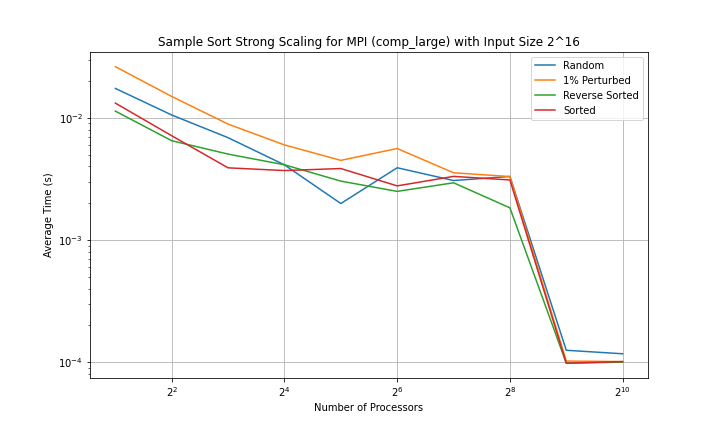
#### Graph Overview
These graphs represent the MPI and CUDA implementation for Sample Sort and the measure the comp_large region's average time taken to sort 2^16 values of various input types (1% Pertubed, Sorted, Reverse Sorted, Random) for an increasing number of threads (CUDA) or processes (MPI).

#### Trends
For both implementations, all of the input types decrease in execution time as the number of threads or processes is increased.

#### Interpretation
The decrease in execution time for both MPI and CUDA suggest that they can both take advantage of the increase parallelism to perform the operations necessary for the algorithm by splitting up the dataset into smaller groups.

### Strong Scaling Analysis for Sample Sort (comm)
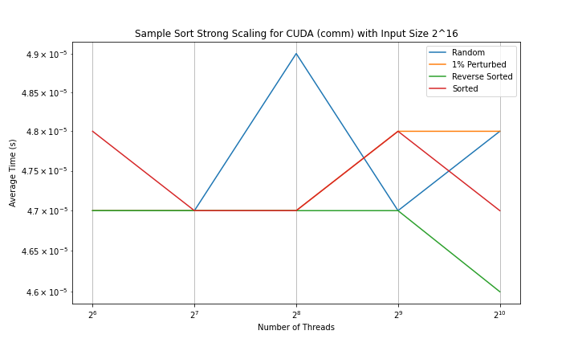
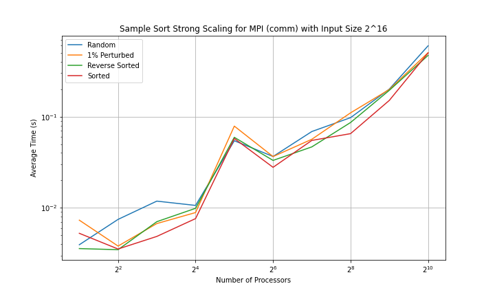
#### Graph Overview
These graphs represent the MPI and CUDA implementation for Sample Sort and the measure the comm region's average time taken to sort 2^16 values of various input types (1% Pertubed, Sorted, Reverse Sorted, Random) for an increasing number of threads (CUDA) or processes (MPI).

#### Trends
For the CUDA implementation, all of the input types stay pretty much the same for the varied number of threads used.

For the MPI implementation, all of the input types increase in execution time as the number of processes is increased.

#### Interpretation
The CUDA graph suggests that for communication, the increased parallelism doesn't affect the time at all, since the lines are pretty horizontal and only change by about a hundredth of a second. This is because the only communication operation used by the CUDA code is just to copy the array of numbers to the GPU and then back, so for a constant array size (2^16 here), that time doesn't change with the increased parallelism.

The MPI graph however suggests that the communication is the biggest portion of the overall execution time of this implementation as it increases with the number of processes. This is because the MPI code requires more communication between the processes since there's a lot of synchronization steps necessary for this algorithm, so as the amount of processes is increased, it takes longer to communicate relevant data between them.

### Weak Scaling Analysis for Sample Sort (main)

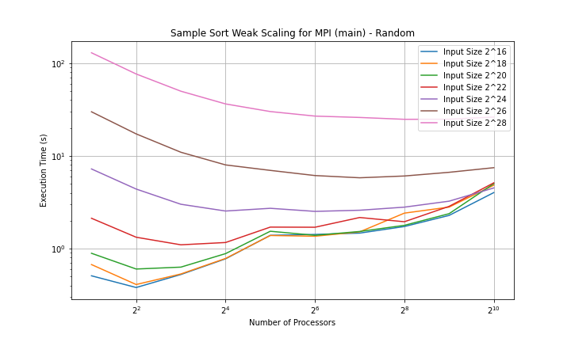
#### Graph Overview
These graphs represent the MPI and CUDA implementation for Sample Sort and the measure the main region's average time taken to sort various input sizes of random input type for an increasing number of threads (CUDA) or processes (MPI).

#### Trends
For the CUDA implementation, all of the input sizes decrease in execution time as the number of threads is increased.

For the MPI implementation, the smaller input sizes increase in execution times as the number of processors is increased, and the bigger input sizes decrease and then stagnate.

#### Interpretation
Since this is weak scaling, for CUDA, the decrease actually means the algorithm is taking better advantage of the increased parallelism than expected.

For MPI, the increase for the smaller sizes indicate that the parallelism overheads outweigh the benefits of the increased number of processes, whereas the bigger input sizes can properly take advantage of it.

### Weak Scaling Analysis for Sample Sort (comp_large)
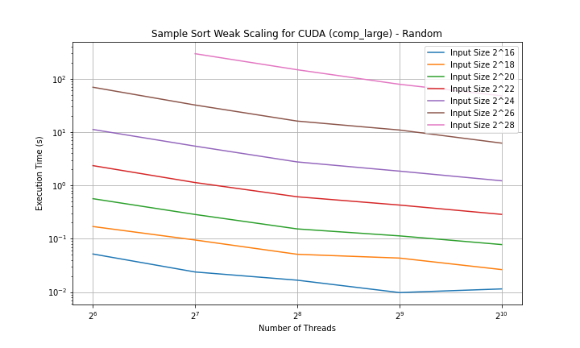
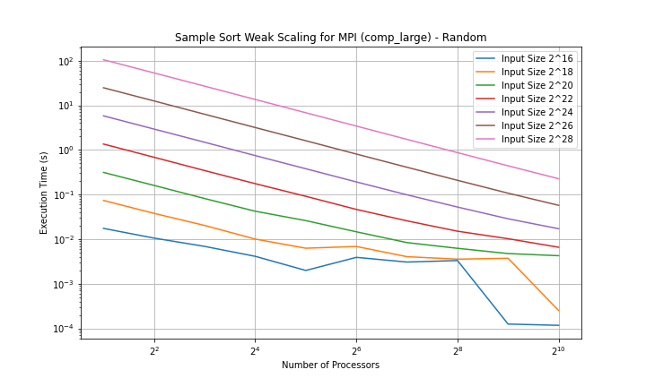
#### Graph Overview
These graphs represent the MPI and CUDA implementation for Sample Sort and the measure the comp_large region's average time taken to sort various input sizes of random input type for an increasing number of threads (CUDA) or processes (MPI).

#### Trends
For both implementations, all of the input sizes decrease in execution time as the number of threads or processes is increased.

#### Interpretation
This trend suggests that the increased parallelism is extremely beneficial for the big computational tasks, especially for MPI (steeper slope downwards).

### Weak Scaling Analysis for Sample Sort (comm)
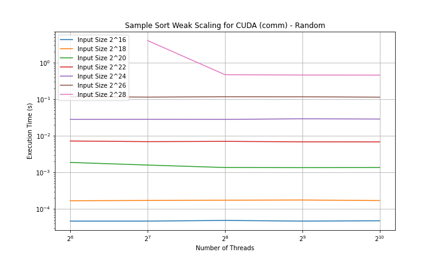
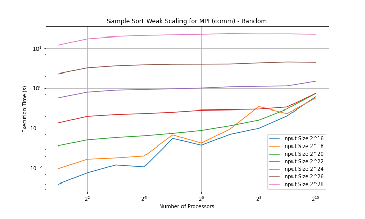
#### Graph Overview
These graphs represent the MPI and CUDA implementation for Sample Sort and the measure the comm region's average time taken to sort various input sizes of random input type for an increasing number of threads (CUDA) or processes (MPI).

#### Trends
For the CUDA implementation, all of the input sizes stay pretty much the same for the varied number of threads used.

For the MPI implementation, all of the input types increase in execution time as the number of processes is increased, with the smaller input sizes increasing more steeply.

#### Interpretation
For CUDA, communication only consists of copying the data to the GPU and back, so the increased parallelism has no effect on this. In addition, this is why the input sizes go in order from bottom to top because the smaller the input size, the less data there is to copy and thus faster.

For MPI, the increase for all input sizes suggests that the numerous communications introduce a significant overhead, overriding any possible decrease from the computations. For the smaller input sizes, this overhead is felt more as there's less data transmitted but similar overhead.

### Strong Scaling Speedup Analysis for Sample Sort (main)
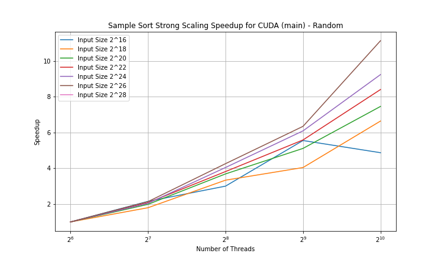
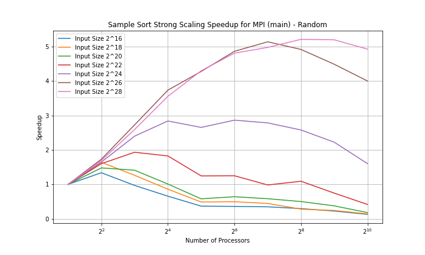
#### Graph Overview
These graphs represent the MPI and CUDA implementation for Sample Sort and the measure the main region's speedup for sorting various input sizes of random input type for an increasing number of threads (CUDA) or processes (MPI).

#### Trends
For the CUDA implementation, all input sizes increase in the amount of speedup they provide as the number of threads is increased.

For the MPI implementation, all input sizes initially increased with the number of processes, but the smaller the input size, the quicker (fewer number of processes) it starts to decrease again.

#### Interpretation
The speedup for CUDA suggests it is a very efficient parallel algorithm, capable of reaching up to 10 times speedup for the biggest input sizes and 2^10 threads.

The speedup for MPI is a bit more complicated, indicating a not so very efficient parallel approach, with smaller input sizes actually getting slower with more processes. The only way to actually speed up is to use bigger input sizes to make the overhead of using more processes worth it.

### Strong Scaling Speedup  Analysis for Sample Sort (comp_large)
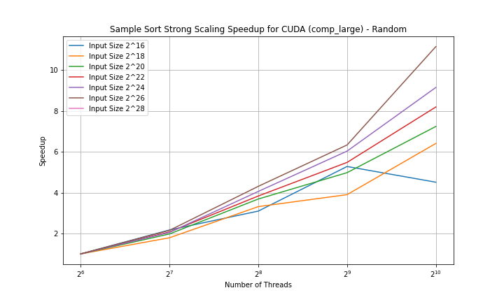
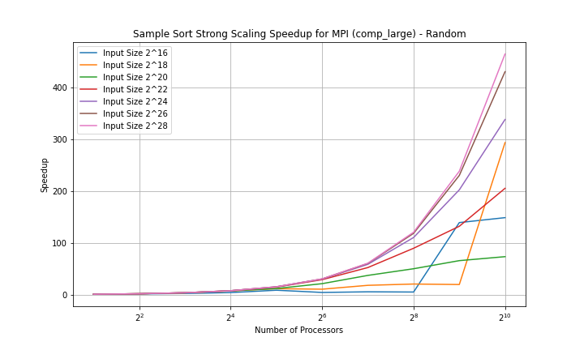
#### Graph Overview
These graphs represent the MPI and CUDA implementation for Sample Sort and the measure the comp_large region's speedup for sorting various input sizes of random input type for an increasing number of threads (CUDA) or processes (MPI).

#### Trends
For both implementations, all of the input sizes increase in how much they speedup as the number of threads or processes is increased.

#### Interpretation
This trend suggests that the increased parallelism is extremely beneficial for the big computational tasks, resulting in about a 10 times speedup for CUDA's biggest input sizes, but an insane 400 times increase for MPI's biggest input sizes. This means that MPI is actually better at scaling/speeding up for computational tasks.

### Strong Scaling Speedup Analysis for Sample Sort (comm)
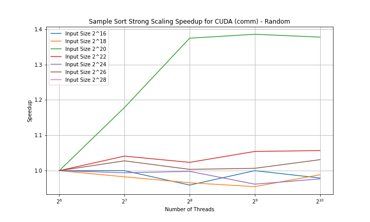
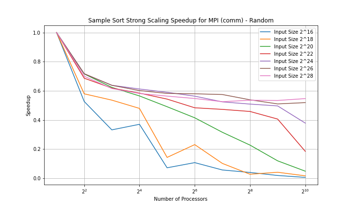
#### Graph Overview
These graphs represent the MPI and CUDA implementation for Sample Sort and the measure the comm region's speedup for sorting various input sizes of random input type for an increasing number of threads (CUDA) or processes (MPI).

#### Trends
For the CUDA implementation, all of the input sizes stay at around the 1.0 speedup mark, with the 2^20 input size being an outlier.

For the MPI implementation, all of the input sizes decreased with the number of processes used.

#### Interpretation
As mentioned previously, for the CUDA implementation, there isn't much in the communication region so the increased parallelism has no effect on increasing the speed.

Similarly, as before for the MPI implementation, the communication actually gets slower with more processes as a result of the amount of messages sent and the overhead associated with them, with the bigger input sizes able to cancel out some of that communication overhead with faster computation times.


## Performance Analysis of Parallel Bitonic Sort

### Strong Scaling Analysis for Bitonic Sort (main)
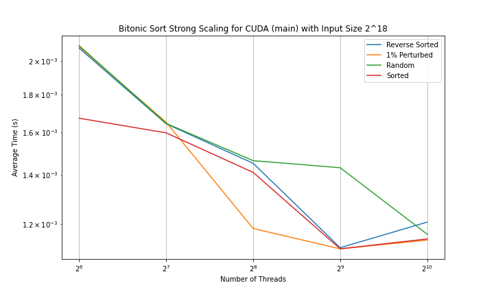
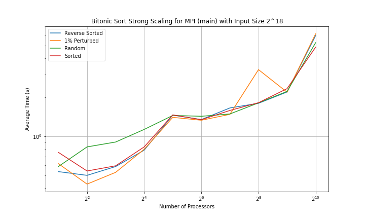
#### Graph Overview
- These graphs represent the MPI and CUDA implementation for Bitonic Sort and the measure the main region's average time taken to sort 2^18 values of various input types (1% Pertubed, Sorted, Reverse Sorted, Random) for an increasing number of threads (CUDA) or processes (MPI).

#### Trends
- For the CUDA implmentation, the graph shows a downward trend. The input types decrease in execution time as the number of threads increase.
- For the MPI implmentation, the graph shows an upward trend. The input types increase in execution time as the number of processes increase.

#### Interpretation
- For CUDA this shows that the sorting algorithm can take advantage of the increase in parallelism available.
- For MPI this shows that while the sorting algorithm can take advantage of the increase in parallelism overall, with all the other sequential processes that need to be done that, the overall time increased.

### Strong Scaling Analysis for Bitonic Sort (comp_large)
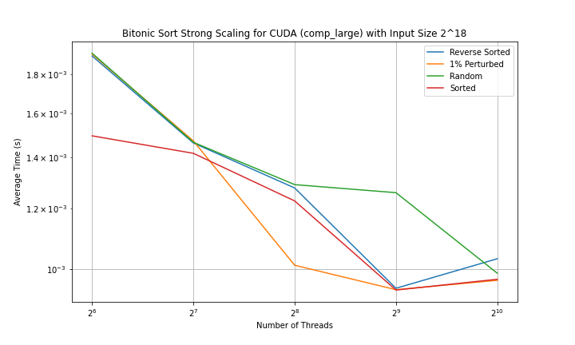
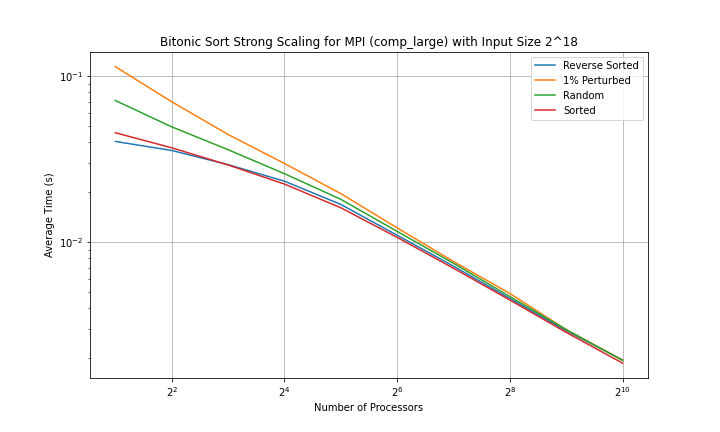
#### Graph Overview
- These graphs represent the MPI and CUDA implementation for Bitonic Sort and the measure the comp_large region's average time taken to sort 2^18 values of various input types (1% Pertubed, Sorted, Reverse Sorted, Random) for an increasing number of threads (CUDA) or processes (MPI).

#### Trends
- For the both implmentations, the graph shows a downward trend. The input types decrease in execution time as the number of threads/processes increase.

#### Interpretation
- This shows when it came down to just the computational part of both algorithms they can take full advantage of the increased parallelism, due to the algorithm splitting the dataset into smaller problem sizes.

### Strong Scaling Analysis for Bitonic Sort (comm)
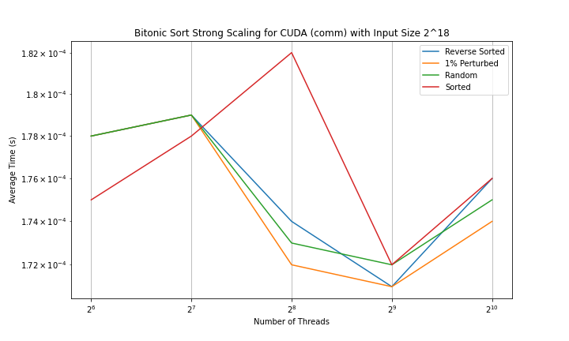
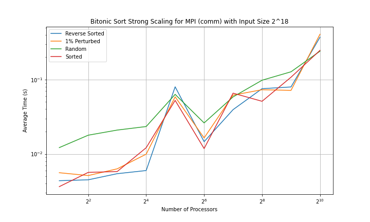
#### Graph Overview
- These graphs represent the MPI and CUDA implementation for Bitonic Sort and the measure the comm region's average time taken to sort 2^18 values of various input types (1% Pertubed, Sorted, Reverse Sorted, Random) for an increasing number of threads (CUDA) or processes (MPI).

#### Trends
- For the CUDA implmentation, the graph shows a downward trend until the end. The input types decrease in execution time as the number of threads increase. There is also an outlier with the Sorted input type at 2^8 threads
- For the MPI implmentation, the graph shows an upward trend. The input types increase in execution time as the number of processes increase.

#### Interpretation
- For CUDA this shows that the sorting algorithm does take advantage of the parallelism until after 2^9 threads due to the overhead of creating more virtual threads the communication takes longer.
- For MPI this shows that communication is taking the longest time since as the number of processes increase so the does the amount of communication and due to some inefficencies in the code it takes longer than expected.

### Weak Scaling Analysis for Bitonic Sort (main)
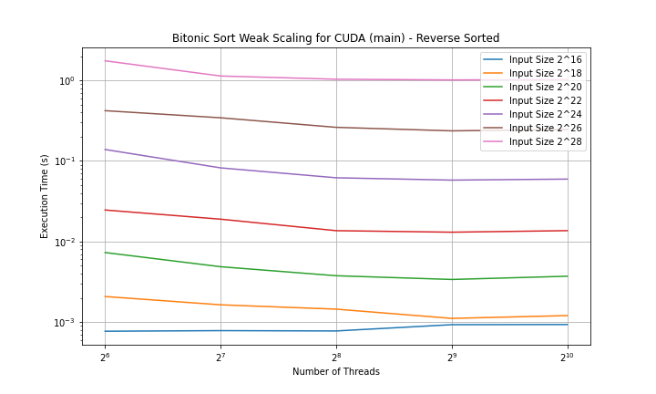
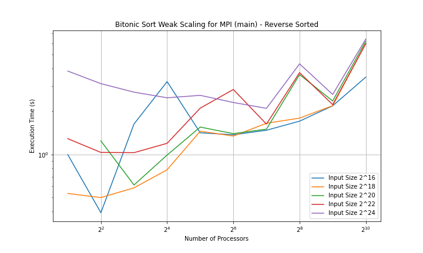
#### Graph Overview
- These graphs represent the MPI and CUDA implementation for Bitonic Sort and the measure the main region's average time taken to sort various input sizes of the reversed sorted input type for an increasing number of threads (CUDA) or processes (MPI).

#### Trends
- For the CUDA implementation, all of the different input sizes decrease in time as the number of threads increase. Except for the smallest input size.
- For the MPI implementation, there is an upward trend, where all of the different input sizes increase in time as the number of threads increase. Except for the smallest input size where it shows a spike at 2^4 processes.

#### Interpretation
- For CUDA, this decrease shows that the algorithm is taking better advantage of the parallisim than expected. Except for the smallest input size due to the overhead of creating the extra threads it does increase.
- For MPI, this increase implies that it can not take full advantage of the parallelisim; however, this could be due to the sequential costs associated with larger datasets as we will explore further in the report.

### Weak Scaling Analysis for Bitonic Sort (comp_large)
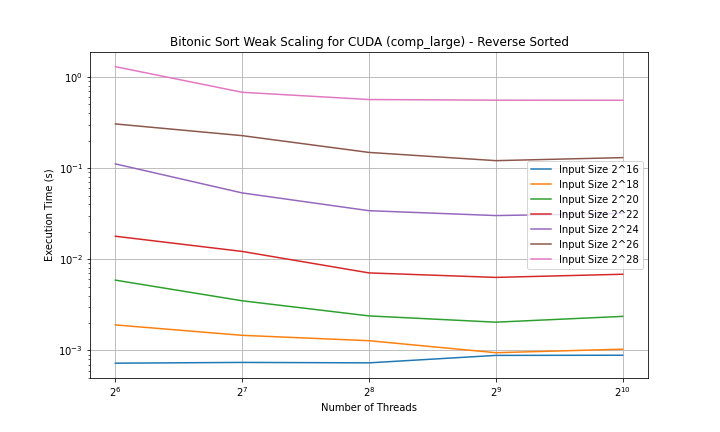
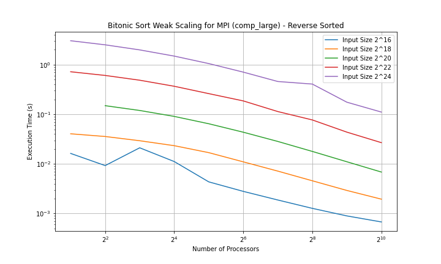
#### Graph Overview
- These graphs represent the MPI and CUDA implementation for Bitonic Sort and the measure the comp_large region's average time taken to sort various input sizes of the reversed sorted input type for an increasing number of threads (CUDA) or processes (MPI).

#### Trends
- For both implementations the overal trend decreases except for the smallest input size for CUDA.

#### Interpretation
- For both this shows that the increased parallelisim greatly benifits both types of algorithms except for the increased overhead of creating virtual threads for the smallest input size in CUDA.

### Weak Scaling Analysis for Bitonic Sort (comm)
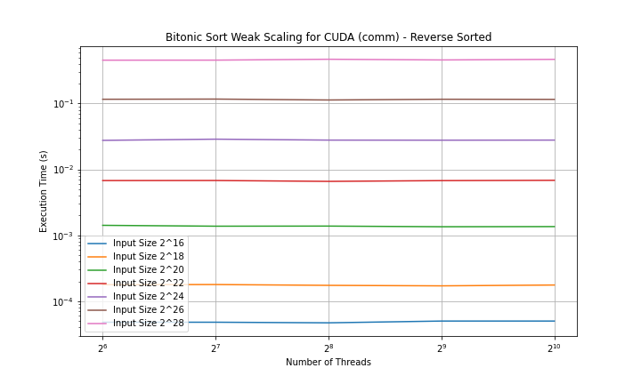
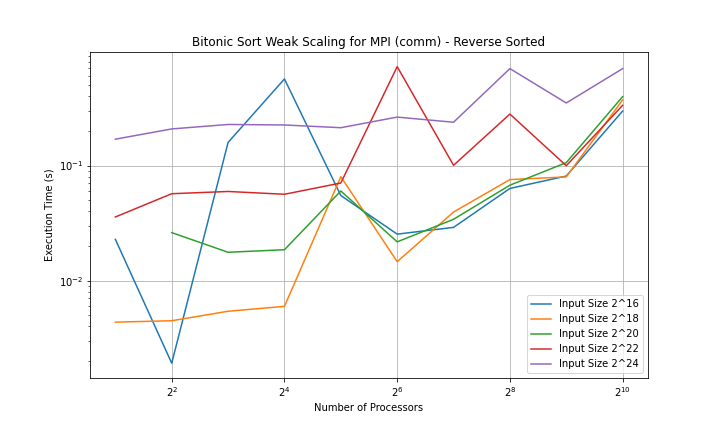
#### Graph Overview
- These graphs represent the MPI and CUDA implementation for Bitonic Sort and the measure the comm region's average time taken to sort various input sizes of the reversed sorted input type for an increasing number of threads (CUDA) or processes (MPI).

#### Trends
- For CUDA the trend lines stay horizontal.
- For MPI the graphs show an upward trend with the smaller input sizes showing a greater upward trend.

#### Interpretation
- For CUDA this shows that the communication part of the algorithm does not benifit from the increase parallelism unlike the comp_large section.
- For MPI this shows that with an increase in processes the communication takes longer this is due to the overhead of the communication done in MPI. Further proof of this is how the smaller input sizes sharply increase in execution time compared to the other input sizes. This shows that the overhead is impacts the smaller sizes over the larger sizes due to the larger sizes having to communicate more either way. This shows how there was a bottleneck in performance due to the overhead caused by communication.  


### Strong Scaling Speedup Analysis for Bitonic Sort (main)
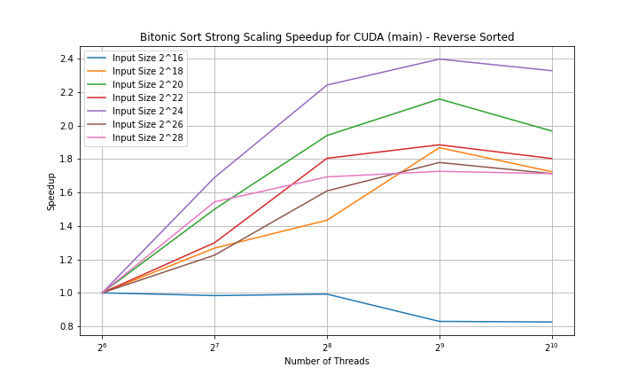
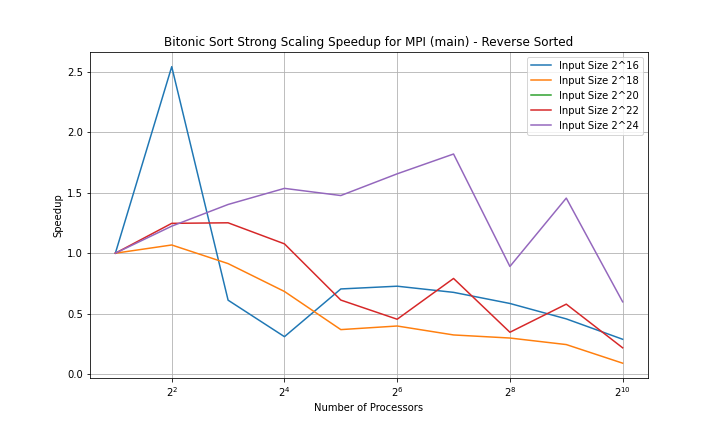
#### Graph Overview
- These graphs represent the MPI and CUDA implementation for Bitonic Sort and the measure the main region's speedup to sort various input sizes of the reversed sorted input type for an increasing number of threads (CUDA) or processes (MPI).

#### Trends
- For the CUDA implementation, all of the different input sizes increase in speedup as the number of threads is also increased. Except for the last data point of number of threads.
- For the MPI implementation, there is a downward trend after a small upward trend in the beginning.

#### Interpretation
- For CUDA, this increase shows that the algorithm is an efficent algorithm. However, at the last increase of threads it shows the overhead of creating the extra threads caused the algorithm to not speedup as much as it did before.
- For MPI, this decrease implies the sequential costs of the algorithms such as checking the array and also the inefficent communication led the algorithm not speeding up as expected.

### Strong Scaling Speedup Analysis for Bitonic Sort (comp_large)
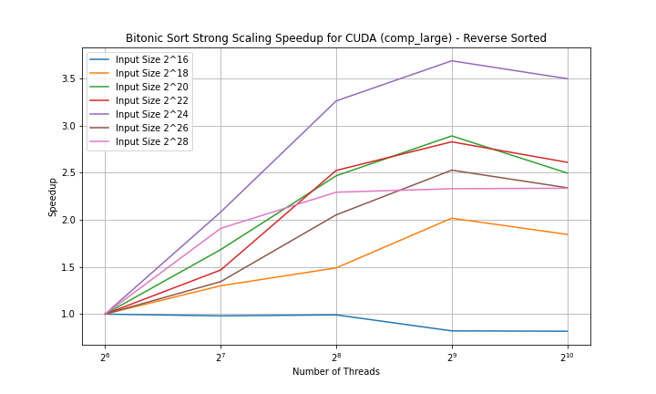
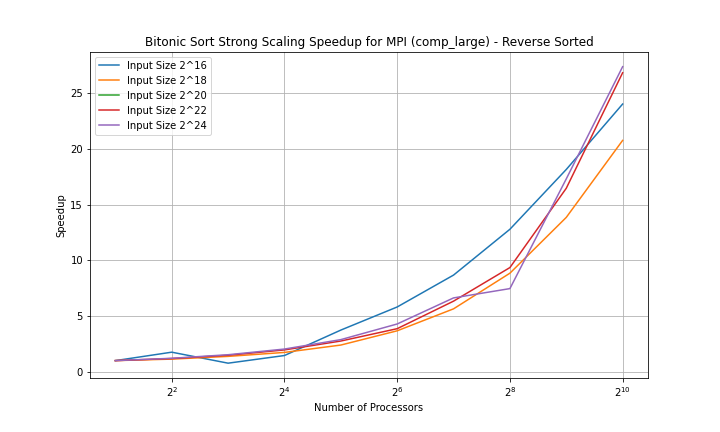
#### Graph Overview
- These graphs represent the MPI and CUDA implementation for Bitonic Sort and the measure the comp_large region's speedup to sort various input sizes of the reversed sorted input type for an increasing number of threads (CUDA) or processes (MPI).

#### Trends
- For both implementations the overal trend decreases except for the last thread increase in CUDA. Additionally, for MPI the trend exponentially increased.

#### Interpretation
- For both this shows that the increased parallelisim is benefical for both. CUDA showed an incread of 3.5x as expected. However, MPI showed exponential growth showing an incread of almost 30x speedup showing how MPI could be better at computational tasks compared to CUDA.

### Strong Scaling Speedup Analysis for Bitonic Sort (comm)
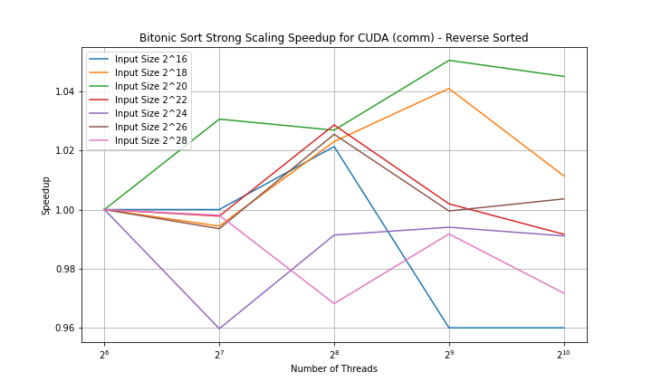
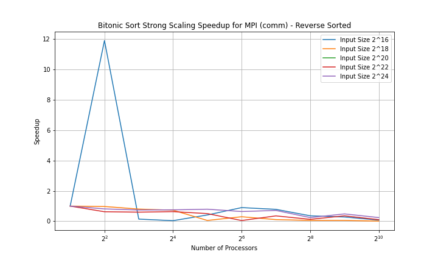
#### Graph Overview
- These graphs represent the MPI and CUDA implementation for Bitonic Sort and the measure the comm region's speedup to sort various input sizes of the reversed sorted input type for an increasing number of threads (CUDA) or processes (MPI).

#### Trends
- For CUDA the trend intially showed an upwards trend; however, with an increase in threads the trend changed to a downwards trend.
- For MPI the graphs stayed mostly flat except for a spike with the smallest input size.

#### Interpretation
- For CUDA this shows that the communication part speedup with an increase in threads up to a certain point where the overhead was actually decreased the speedup.
- For MPI this shows that with an increase in processes the does not benifit the communication nearly as much especially as the trend was slightly downwards. This is due to the fact that the larger messages and overhead counteracted the increase in performance provided by number of processes. This also shows the main graph downward trend was mainly due to the inclusion of sequential parts of the algorithm. 

## Performance Analysis of Parallel Merge Sort

### Strong Scaling Analysis for MergeSort (main)
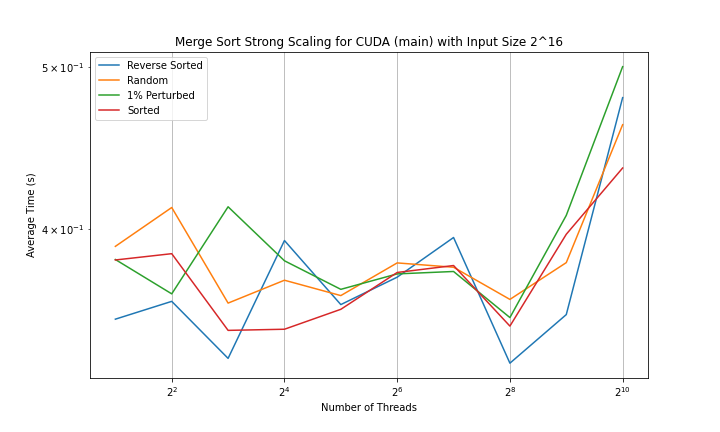
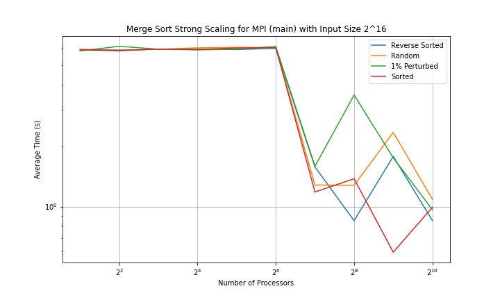
#### Graph Overview

#### Trends

#### Interpretation

### Strong Scaling Analysis for MergeSort (comp_large)
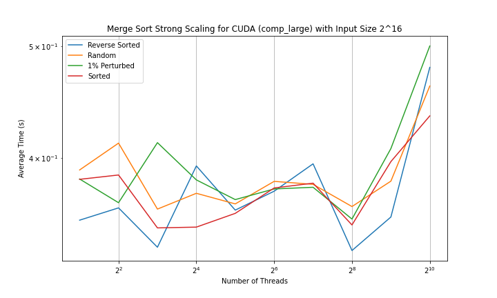
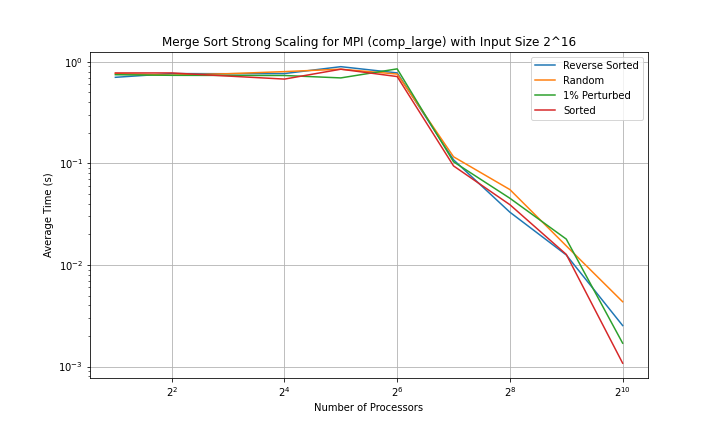
#### Graph Overview

#### Trends

#### Interpretation

### Strong Scaling Analysis for MergeSort (comm)
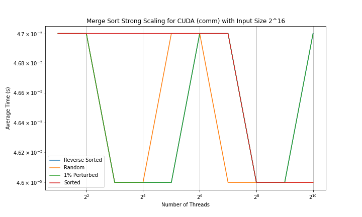

#### Graph Overview

#### Trends

#### Interpretation

### Weak Scaling Analysis for MergeSort (main)
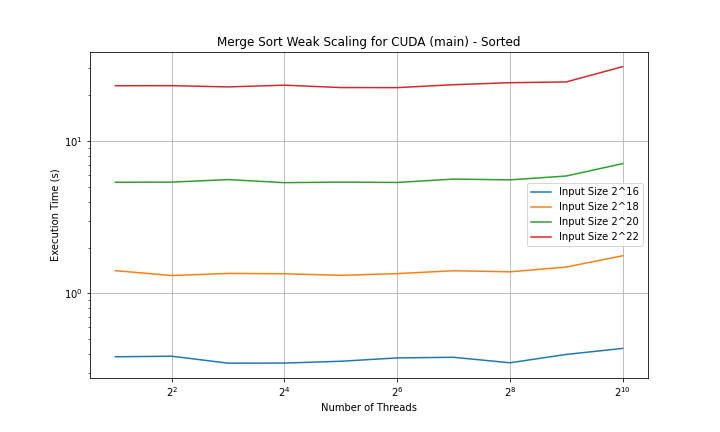
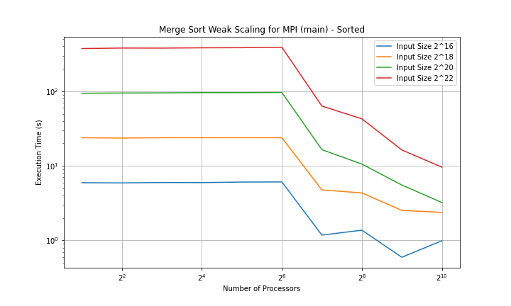
#### Graph Overview

#### Trends

#### Interpretation

### Weak Scaling Analysis for MergeSort (comp_large)
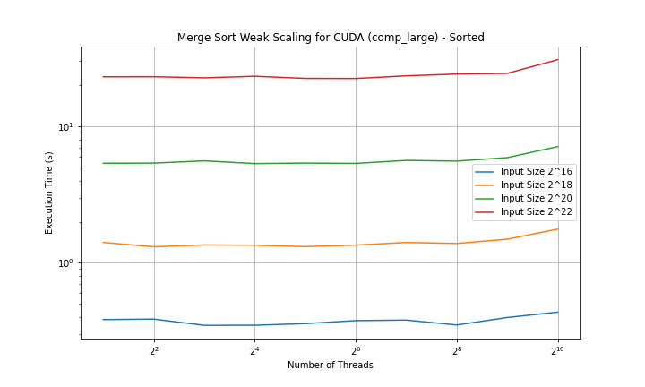
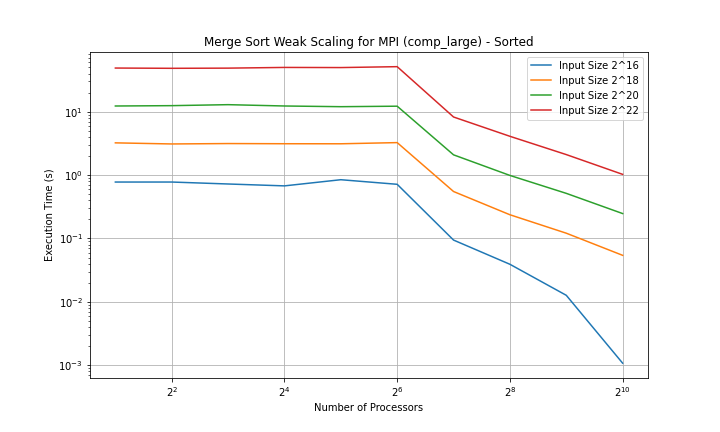
#### Graph Overview

#### Trends

#### Interpretation

### Weak Scaling Analysis for MergeSort (comm)
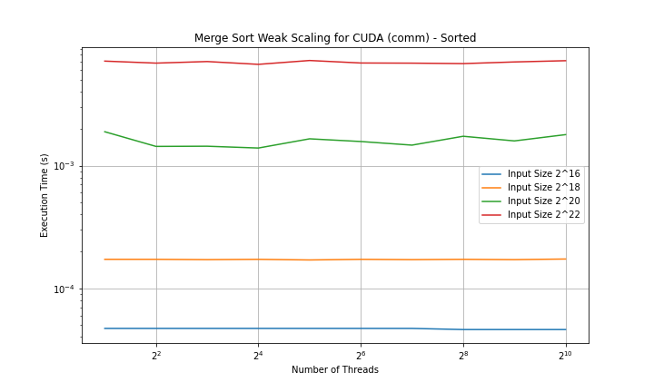
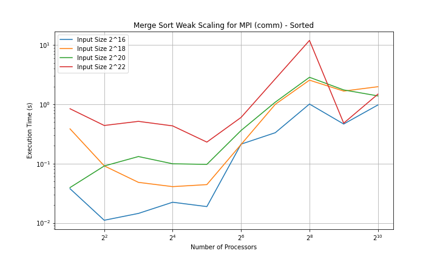
#### Graph Overview

#### Trends

#### Interpretation

### Strong Scaling Speedup Analysis for MergeSort (main)
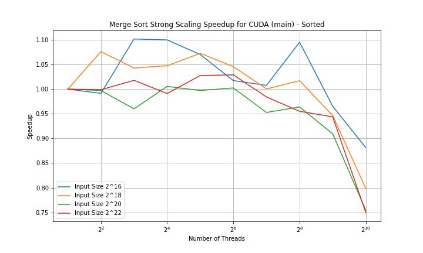
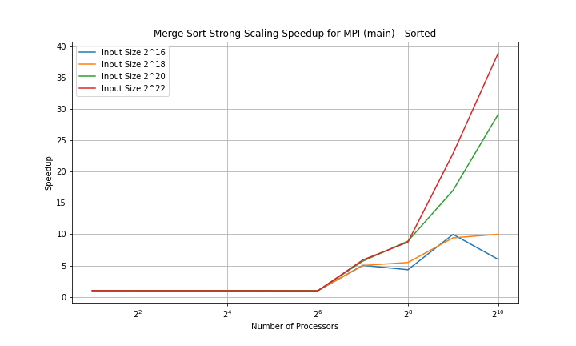
#### Graph Overview

#### Trends

#### Interpretation

### Strong Scaling Speedup  Analysis for MergeSort (comp_large)
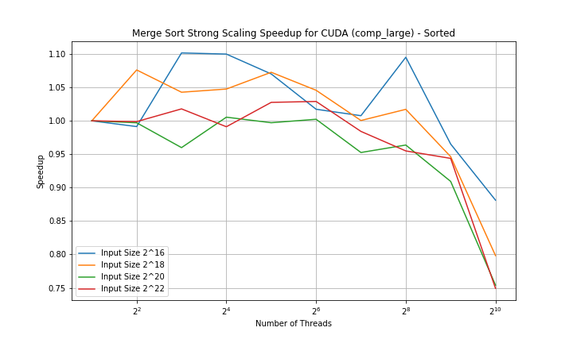
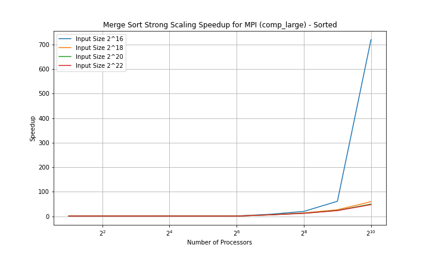
#### Graph Overview

#### Trends

#### Interpretation

### Strong Scaling Speedup Analysis for MergeSort (comm)


#### Graph Overview

#### Trends

#### Interpretation

## Performance Analysis of Parallel Odd-Even Transposition Sort

### Strong Scaling Analysis for Odd-Even Sort (main)


#### Graph Overview
These graphs represent the MPI and CUDA implementation for Odd-Even Sort and the measure the main region's average time taken to sort 2^24 values of various input types (1% Pertubed, Sorted, Reverse Sorted, Random) for an increasing number of threads (CUDA) or processors (MPI).

#### Trends
For CUDA, the average time decreases from 2^6 sharply for all input types as threads increase, and decreases for all types except reverse sorted from 2^7 to 2^8. After 2^8, average time stays relatively the same.

For MPI, all input types increase in average time as processors increase.

#### Interpretation
Parallelization for CUDA has no effect significant impact past 2^8 threads, and for MPI it seems to have a negative impact, likely due to the communication overhead. 

### Strong Scaling Analysis for Odd-Even Sort (comp_large)


#### Graph Overview
These graphs represent the MPI and CUDA implementation for Odd-Even Sort and the measure the comp_large region's average time taken to sort 2^24 values of various input types (1% Pertubed, Sorted, Reverse Sorted, Random) for an increasing number of threads (CUDA) or processors (MPI).

#### Trends
For CUDA, comp_large is similar to main, the average time decreases from 2^6 sharply for all input types as threads increase, and decreases for all types except reverse sorted from 2^7 to 2^8. After 2^8, average time stays relatively the same.

For MPI, average execution time stays relatively the same up to 2^6 processors, where it then significantly decreases up to 2^10 processors for all input types.

#### Interpretation
Parallelization for CUDA has no effect significant impact past 2^8 threads, likely due to poor implementation, and for MPI computation is improved significantly by increasing processors, so it parallelizes well.

### Strong Scaling Analysis for Odd-Even Sort (comm)


#### Graph Overview
These graphs represent the MPI and CUDA implementation for Odd-Even Sort and the measure the comm region's average time taken to sort 2^24 values of various input types (1% Pertubed, Sorted, Reverse Sorted, Random) for an increasing number of threads (CUDA) or processors (MPI).

#### Trends
For CUDA, comm seems to be quite sporadic for all input types, with the least sporadic being 1% pertubed. However, there is an overall downward trend in execution time as threads increase for all input types.

For MPI, comm resembles main in that execution time has a steady increase as number of processors increase.

#### Interpretation
These trends make sense as MPI has a lot of communication overhead, which can hurt its parallelization.

### Weak Scaling Analysis for Odd-Even Sort (main)


#### Graph Overview
These graphs represent the MPI and CUDA implementation for Odd-Even Sort and the measure the main region's average time taken to sort various input sizes of sorted input type for an increasing number of threads (CUDA) or processors (MPI).

#### Trends
For CUDA, average execution time stays relatively the same for all input sizes as threads increase. The higher the input size, the longer the execution time.

For MPI, the higher the input size, the less of an impact is had as the number of processors increase, but generally as processors increase execution time does as well.

#### Interpretation
Evidently, CUDA is not parallelizing well. For MPI, for this input type, there is no benefit to parallelization and it hurts the execution time to use it.

### Weak Scaling Analysis for Odd-Even Sort (comp_large)


#### Graph Overview
These graphs represent the MPI and CUDA implementation for Odd-Even Sort and the measure the comp_large region's average time taken to sort various input sizes of sorted input type for an increasing number of threads (CUDA) or processors (MPI).

#### Trends
For CUDA, comp_large is similar to main here.

For MPI, comp_large generally decreases as number of processors increases.

#### Interpretation
Computation is the limiting factor for CUDA and is the benefiting factor for MPI due to parallelization. However, for MPI it is not significant enough to make up for the negatives from communication.

### Weak Scaling Analysis for Odd-Even Sort (comm)


#### Graph Overview
These graphs represent the MPI and CUDA implementation for Odd-Even Sort and the measure the comm region's average time taken to sort various input sizes of sorted input type for an increasing number of threads (CUDA) or processors (MPI).

#### Trends
For CUDA, comm region execution time is relatively the same as threads increase.

For MPI, comm region execution time increases for all input sizes as processors increase.

#### Interpretation
Communication for both CUDA and MPI does not parallelize well. For CUDA, it has hardly any effect on the overall time. For MPI, it is the limiting factor as it has the most significant effect on execution time of the program.

### Strong Scaling Speedup Analysis for Odd-Even Sort (main)


#### Graph Overview
These graphs represent the MPI and CUDA implementation for Odd-Even Sort and the measure the main region's speedup for sorting various input sizes of sorted input type for an increasing number of threads (CUDA) or processors (MPI).

#### Trends
For CUDA, speedup increases as threads increase up until 2^8-2^9 threads or so, then it levels out.

For MPI, speedup generally decreases as processors increase.

#### Interpretation
Parallelization seems to hurt MPI overall, while for CUDA it is beneficial up until threads of size 2^9.

### Strong Scaling Speedup Analysis for Odd-Even Sort (comp_large)


#### Graph Overview
These graphs represent the MPI and CUDA implementation for Odd-Even Sort and the measure the comp_large region's speedup for sorting various input sizes of sorted input type for an increasing number of threads (CUDA) or processors (MPI).

#### Trends
For CUDA, comp_large resembles main, speedup increases as threads increase up until 2^8-2^9 threads or so, then it levels out.

For MPI, comp_large has significant increase in speedup from 2^6 to 2^10 processors.

#### Interpretation
Parallelization has a benefit for both computation regions of CUDA and MPI, but has a much more significant impact on MPI.

### Strong Scaling Speedup Analysis for Odd-Even Sort (comm)


#### Graph Overview
These graphs represent the MPI and CUDA implementation for Odd-Even Sort and the measure the comm region's speedup for sorting various input sizes of sorted input type for an increasing number of threads (CUDA) or processors (MPI).

#### Trends
For CUDA, comm is sporadic but generally stays around the same speedup as threads increase.

For MPI, speedup slows down as number of processors increase for all input sizes.

#### Interpretation
It is clear that communication is the limiting factor for MPI, due to the more occurences of MPI_Sendrecv as processors increase. For CUDA, communication does not have much of an impact.


## Algorithm Comparisons

### main


#### Graph Overview
These graphs represent the MPI and CUDA implementations of all the algorithms and measure the main region's average execution time for sorting values of size 2^16 of a random input type.

#### Trends
Generally for all algorithms, besides merge sort, increasing the number of processors decreases execution time for MPI. With Odd-Even being the quickest at the lower processors and being the slowest at higher processors, and merge being the slowest at fewer processors, but the quickest at higher processors.

Generally for all algorithms, execution time stays the same as number of threads increase. With Bitonic being the quickest, and Merge being the slowest.

#### Interpretation
Parallelization has the most benefit with merge sort in MPI and it hurts Odd-Even the most. For CUDA, there is not much of an effect of paralellizing.

### comm


#### Graph Overview
These graphs represent the MPI and CUDA implementations of all the algorithms and measure the comm region's average execution time for sorting values of size 2^16 of a random input type.

#### Trends
For MPI, this resembles the main region, where increasing the number of processors decreases execution time for MPI. With Odd-Even being the quickest at the lower processors and being the slowest at higher processors. However, merge has moved to be in the middle between odd-even and the rest of the algorithms.

For CUDA, comm is quite sporadic for all algorithms, with bitonic being the slowest and merge being the quickest. Merge stays the same as threads increase, odd-even decreases from 2^7 to 2^8 then stays the same, while the others jump around.

#### Interpretation
It is clear that MPI for all algorithms has a strong communication impact, however for merge it appears to not be the limiting factor like it is for the others. For CUDA, comm does not seem to be quite significant.

### comp_large


#### Graph Overview
These graphs represent the MPI and CUDA implementations of all the algorithms and measure the comp_large region's average execution time for sorting values of size 2^16 of a random input type.

#### Trends
For all algorithms in MPI, generally execution time decreases as number of processors increases, with merge having the biggest decrease.

For all algorithms in CUDA, generally execution time stays the same as number of threads increases.

#### Interpretation
This shows how computation benefits the most with MPI as increasing the number of processors improves computational parallelization. However with CUDA, it seems to have not much of an effect.

## Plots


